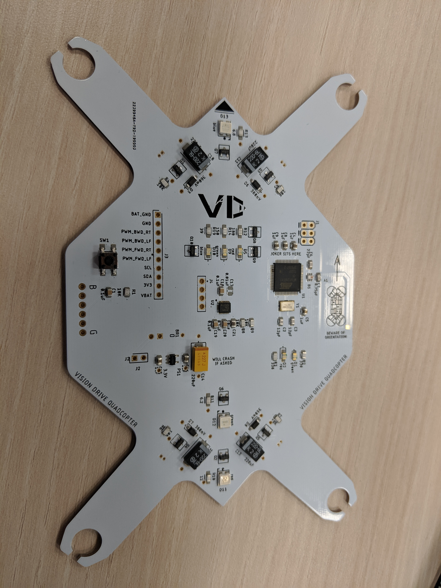
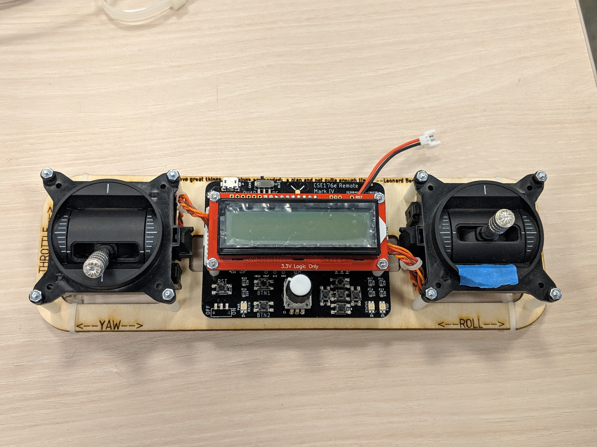

Before solder paste:

After placing components:

Fully assembled:

Fully assembled with lights:

Remote:

Removing Solder with a Solder Wick:

[Videos on Youtube](https://www.youtube.com/watch?v=ZCH8uB1S5-c&list=PL8dJ9b_hsVTQ4joJ3tLPn5C7kKkjgR0M6)
